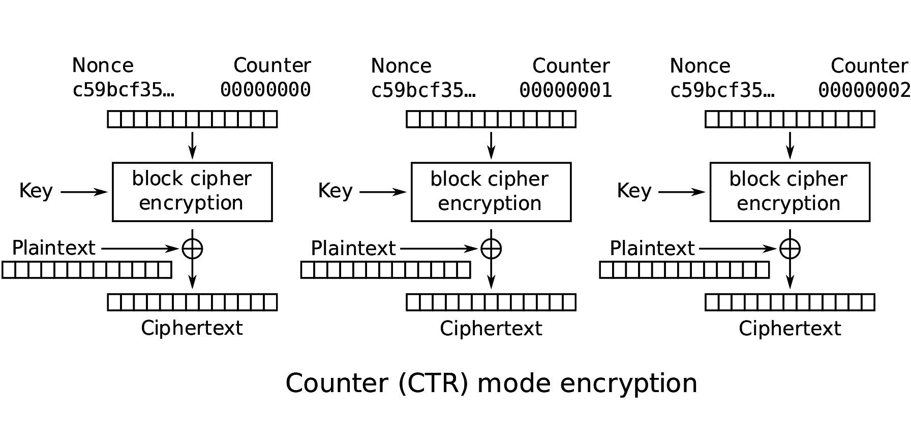

# Cryptovirus writeup

## Walkthrough

### Information gathering

On the machine we can see 3 encrypted files:

- `flag.txt`: The flag we must decrypt
- `CIS_Microsoft_Windows_Server_2012_R2_Benchmark_v220.pdf`
- `guide_hygiene_informatique_anssi.pdf`

The last 2 files are public and their plaintext copy can be found online.

For clarity we will refer to the encrypted versions of the file with the `.enc` extention so we have:

- `flag.txt.enc`
- `CIS_Microsoft_Windows_Server_2012_R2_Benchmark_v220.pdf.enc`
- `guide_hygiene_informatique_anssi.pdf.enc`
- `CIS_Microsoft_Windows_Server_2012_R2_Benchmark_v220.pdf`
- `guide_hygiene_informatique_anssi.pdf`

We notice that first 16 bytes of all encrypted files are the same (here displayed in base64)

> 4ccAin1bTsG1ZWA9aBYxXg==

With this information we can assume that the encryption process is the same for all files, and might be reusing the same key (as well as any potential IV / nonce).

### Attack explanation

Assuming the scheme uses a form of XOR based cipher (either directly or through the block mode of operation), as, for exemple, any block cypher (e.g. AES) using the counter (CTR) block cipher mode of operation:



The encryption process can be expressed as

$C = P \oplus E(key, IV)$  
where  
$C$ is the resulting cyphertext  
$P$ is the original plaintext  
$E(key, IV)$ is a derivation function of the key and IV, independent of the plaintext  
$\oplus$ is the XOR operator

With two different files we have

$C_1 = P_1 \oplus E_1$

$C_2 = P_2 \oplus E_2$

If the key and IV used are the same, as we assumed previously, then $E_1 = E_2 = E$

$C_1 \oplus C_2 = (P_1 \oplus E) \oplus (P_2 \oplus E)$  
$\Leftrightarrow C_1 \oplus C_2 = (P_1 \oplus P_2) \oplus (E \oplus E)$  
$\Leftrightarrow C_1 \oplus C_2 = P_1 \oplus P_2$  
$\Leftrightarrow P_2 = P_1 \oplus C_1 \oplus C_2$

### Attack execution

To compute the `flag.txt` plaintext, we can therefore use the XOR of `flag.txt.enc`, another encrypted file (`CIS_Microsoft_Windows_Server_2012_R2_Benchmark_v220.pdf.enc` or `guide_hygiene_informatique_anssi.pdf.enc`) and the corresponding plaintext file (respectively `CIS_Microsoft_Windows_Server_2012_R2_Benchmark_v220.pdf` or `guide_hygiene_informatique_anssi.pdf`). Keep in mind the first 16 bytes of the encrypted files are not part of the cyphertext and we only need to compute up to the length of the `flag.txt.enc` file (48 bytes long here).

Small implementation in Python:

```py
from pwn import xor

with open("flag.txt.enc", "rb") as f:
    flag_txt_cypher = f.read(48)[16:]

with open("guide_hygiene_informatique_anssi.pdf.enc", "rb") as f:
    known_cypher = f.read(48)[16:]

with open("guide_hygiene_informatique_anssi.pdf", "rb") as f:
    known_plain = f.read(32)  # 32 = 48 - 16

flag_txt_plain = xor(flag_txt_cypher, known_cypher, known_plain)

print(flag_txt_plain.decode())
```

> flag_Crypt0Virus-Is_Weak!\x00\x00\x00\x00\x00\x00\x00

We can then remove the null bytes padding and surrond it with "MALICE{}" to get the final flag.

## Flag

> MALICE{flag_Crypt0Virus-Is_Weak!}

## Full script

```py
#!/usr/bin/env python

from pwn import xor

FLAG_TXT_CYPHER_FILENAME  = "flag.txt.enc"
CIS_CYPHER_FILENAME       = "CIS_Microsoft_Windows_Server_2012_R2_Benchmark_v220.pdf.enc"
CIS_PLAIN_FILENAME        = "CIS_Microsoft_Windows_Server_2012_R2_Benchmark_v220.pdf"
ANSSI_CYPHER_FILENAME     = "guide_hygiene_informatique_anssi.pdf.enc"
ANSSI_PLAIN_FILENAME      = "guide_hygiene_informatique_anssi.pdf"

SIZE = 32
OFFSET = 16

def getflag(flag_txt: bytes) -> str:
    return "MALICE{" + flag_txt.strip(b"\x00").decode() + "}"

def main():
    with open(FLAG_TXT_CYPHER_FILENAME, "rb") as f:
        flag_txt_cypher = f.read(SIZE + OFFSET)[OFFSET:]

    with open(CIS_CYPHER_FILENAME, "rb") as f:
        known_cypher = f.read(SIZE + OFFSET)[OFFSET:]

    with open(CIS_PLAIN_FILENAME, "rb") as f:
        known_plain = f.read(SIZE)

    flag_txt_plain = xor(flag_txt_cypher, known_cypher, known_plain)

    flag = getflag(flag_txt_plain)

    print(flag)

if __name__ == "__main__":
    main()
```
